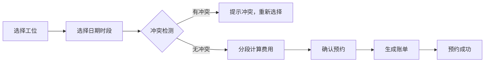
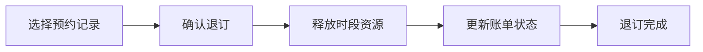
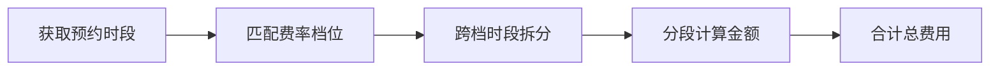

## 1. 产品概述

摄影工作室暗房冲洗工位预约与计费管理系统，为传统胶片摄影工作室提供暗房工位预约、冲突检测、时段计费、账单生成的全流程数字化管理。

- 核心价值：解决人工预约易冲突、计费不透明、账单难追溯的行业痛点
- 目标用户：胶片摄影工作室经营者、暗房技师、胶片摄影爱好者

## 2. 核心功能

### 2.1 用户角色

| 角色 | 登录方式 | 核心权限 |
|------|---------|---------|
| 管理员 | 本地系统 | 工位管理、费率配置、预约管理、账单管理、冲扫登记 |
| 操作员 | 本地系统 | 工位预约、查看账单、冲扫登记 |

### 2.2 功能模块

1. **工位排期模块**：工位日历视图、时段选择、预约管理、退订操作
2. **冲突校验模块**：时段重叠检测、预约冲突提示、退订时段释放
3. **时段计费模块**：费率表维护、高峰/平峰费率、跨档时长拆分、分段金额合计
4. **账单生成模块**：账单列表、账单详情、账单状态管理
5. **胶片冲扫登记**：冲扫任务登记、冲扫进度跟踪

### 2.3 页面详情

| 页面名称 | 模块名称 | 功能描述 |
|---------|---------|----------|
| 工作台 | 概览仪表盘 | 今日预约、待处理账单、工位状态总览 |
| 工位排期 | 日历排期 | 周视图/日视图、工位切换、时段拖拽预约 |
| 工位管理 | 资源建档 | 工位增删改查、工位状态管理 |
| 费率管理 | 费率配置 | 费率档位维护、高峰平峰时段设置 |
| 账单中心 | 账单管理 | 账单列表、账单详情、账单状态流转 |
| 冲扫登记 | 冲扫管理 | 胶片冲扫任务登记、进度跟踪 |

## 3. 核心流程

### 3.1 预约流程

用户选择工位 → 选择日期和时段 → 系统检测冲突 → 无冲突则计算费用 → 确认预约生成账单 → 预约成功

### 3.2 退订流程

选择预约记录 → 确认退订 → 释放时段资源 → 账单更新 → 退订完成

### 3.3 计费流程

获取预约时段 → 匹配费率档位 → 跨档时段拆分 → 分段计算金额 → 合计总费用

## 4. 用户界面设计

### 4.1 设计风格

- **主题风格**：暗房安全灯主题，深色背景配合红色安全灯光效，营造专业暗房氛围
- **主色调**：深酒红色 #8B0000 作为安全灯主色
- **辅助色**：琥珀橙 #D4A574 模拟暗房琥珀色安全灯
- **背景色**：深灰黑 #1a1a1a 模拟暗房黑暗环境
- **文字色**：米白色 #F5F5DC 暗房中的可读文字
- **按钮风格**：圆角按钮，悬停有红色光晕效果
- **字体**：展示字体使用 serif 衬线体模拟胶片质感，正文字体使用等宽字体模拟暗房计时器风格
- **布局风格**：卡片式布局，深色卡片带细微边框，模拟暗房工作台质感
- **图标风格**：线性图标，统一使用 lucide-react

### 4.2 页面设计概览

| 页面名称 | 模块名称 | UI元素 |
|---------|---------|-------|
| 工作台 | 概览仪表盘 | 统计卡片、今日预约列表、快速操作入口、红色光晕动效 |
| 工位排期 | 日历排期 | 周视图时间轴、工位标签、预约色块、拖拽交互 |
| 工位管理 | 资源建档 | 工位卡片列表、新增/编辑表单、状态标签 |
| 费率管理 | 费率配置 | 费率表格、时段配置、档位颜色标识 |
| 账单中心 | 账单管理 | 账单列表、筛选器、详情抽屉 |
| 冲扫登记 | 冲扫管理 | 冲扫任务列表、登记表单、进度条 |

### 4.3 响应式设计

- 桌面端优先设计，1440px 基准宽度
- 支持平板和移动端自适应
- 触摸优化：触控目标最小 44px
- 时间轴在移动端转为纵向排列

### 4.4 动效与微交互

- 页面加载：渐入动画，模拟暗房灯光慢慢亮起
- 悬停效果：红色安全灯光晕
- 预约成功：琥珀色脉冲效果
- 冲突提示：红色闪烁警告
- 切换动画：平滑过渡，模拟暗房门开关效果
