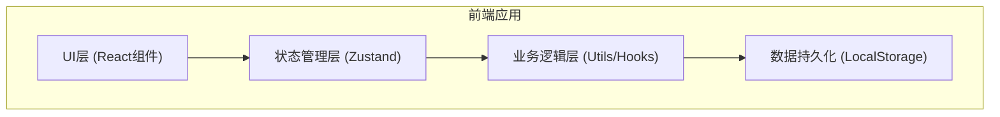
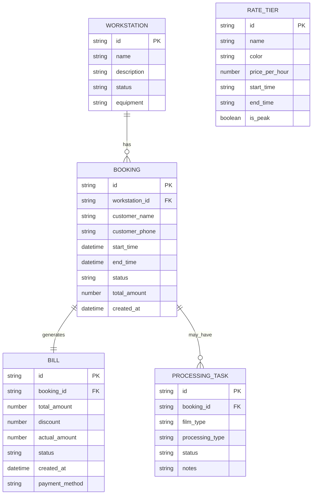

## 1. 架构设计



纯前端单页应用，使用 React + TypeScript + Vite 构建，状态管理使用 Zustand，数据持久化使用 LocalStorage 存储。

## 2. 技术描述

- **前端框架**: React@18 + TypeScript
- **构建工具**: Vite@5
- **样式方案**: Tailwind CSS@3
- **状态管理**: Zustand@4
- **路由管理**: React Router Dom@6
- **图标库**: Lucide React
- **数据持久化**: LocalStorage
- **日期处理**: date-fns

## 3. 路由定义

| 路由路径 | 页面名称 | 用途 |
|---------|---------|------|
| /dashboard | 工作台 | 数据概览、快速操作 |
| /schedule | 工位排期 | 日历视图、预约管理 |
| /workstations | 工位管理 | 工位资源建档维护 |
| /rates | 费率管理 | 时段费率表维护 |
| /bills | 账单中心 | 账单列表与详情 |
| /processing | 冲扫登记 | 胶片冲扫任务管理 |

## 4. 数据模型

### 4.1 数据模型ER图



### 4.2 核心类型定义

```typescript
// 工位
interface Workstation {
  id: string;
  name: string;
  description: string;
  status: 'active' | 'maintenance' | 'inactive';
  equipment: string[];
}

// 费率档位
interface RateTier {
  id: string;
  name: string;
  color: string;
  pricePerHour: number;
  startTime: string;
  endTime: string;
  isPeak: boolean;
}

// 预约
interface Booking {
  id: string;
  workstationId: string;
  customerName: string;
  customerPhone: string;
  startTime: Date;
  endTime: Date;
  status: 'confirmed' | 'cancelled' | 'completed';
  totalAmount: number;
  createdAt: Date;
  feeBreakdown: FeeSegment[];
}

// 计费分段
interface FeeSegment {
  tierId: string;
  tierName: string;
  startTime: Date;
  endTime: Date;
  durationMinutes: number;
  amount: number;
}

// 账单
interface Bill {
  id: string;
  bookingId: string;
  totalAmount: number;
  discount: number;
  actualAmount: number;
  status: 'unpaid' | 'paid' | 'refunded';
  createdAt: Date;
  paymentMethod?: string;
}

// 冲扫任务
interface ProcessingTask {
  id: string;
  bookingId?: string;
  filmType: string;
  processingType: string;
  status: 'pending' | 'processing' | 'completed' | 'picked_up';
  notes: string;
  createdAt: Date;
}
```

## 5. 目录结构

```
src/
├── components/          # 通用组件
│   ├── layout/         # 布局组件
│   ├── ui/             # UI基础组件
│   └── schedule/       # 排期相关组件
├── pages/              # 页面组件
│   ├── Dashboard/
│   ├── Schedule/
│   ├── Workstations/
│   ├── Rates/
│   ├── Bills/
│   └── Processing/
├── store/              # 状态管理
│   └── useStore.ts
├── utils/              # 工具函数
│   ├── booking.ts      # 预约相关
│   ├── billing.ts      # 计费相关
│   └── date.ts         # 日期处理
├── types/              # 类型定义
│   └── index.ts
├── hooks/              # 自定义hooks
├── App.tsx
├── main.tsx
└── index.css
```

## 6. 核心算法

### 6.1 冲突检测算法

检测两个时段是否重叠：

```typescript
function isOverlapping(start1: Date, end1: Date, start2: Date, end2: Date): boolean {
  return start1 < end2 && start2 < end1;
}
```

### 6.2 跨档计费算法

将预约时段按费率档位拆分，计算各段费用：

```typescript
function calculateFee(startTime: Date, endTime: Date, rateTiers: RateTier[]): {
  segments: FeeSegment[];
  total: number;
}
```

算法步骤：
1. 获取所有费率档位并按时段排序
2. 将预约时段与各档位时段求交集
3. 对每个交集时段计算时长和费用
4. 汇总所有分段费用
